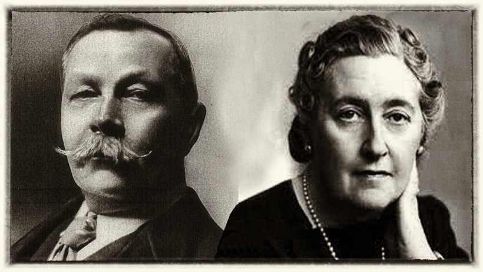

# Classification Problem: Did the post originated from Sherlock or Poirot subreddit

Problem Statement:
An online book publishers wants to commission a fiction detective series and as a part of their marketing research needs to analyse feedback from social media feeds on detective genre.
As one of the parts of the project, we are going to focus on two of the famous detectives: Mr Holmes and Mr Poirot ; and see what reddit has to say about them.

# Table of contents

- [Table of contents](#table-of-contents)
- [Problem-Statement](#problem-statement)
- [Data-Acquisition](#data-acquisition)
- [Data-Cleaning](#data-cleaning)
- [EDA](#eda)
- [Modelling-Strategy](#modelling-strategy)
- [Next-Steps](#next-steps)
- [Additional Information](#additional-information)

# Problem-Statement
[(Back to top)](#table-of-contents)
An online book publishers wants to commission a fiction detective series and as a part of their marketing research needs to analyse feedback from social media feeds on detective genre.
As one of the parts of the project, we are going to focus on two of the famous detectives: Mr Holmes and Mr Poirot ; and see what reddit has to say about them. As a part of the project, we are going to focus on two of the famous detectivesthat have been written about, namely Mr Holmes and Mr Poirot  and see what reddit users have to say about them.
One of the requirement is to build a classification model and hand it over to Marketing Operations to be used for downstream marketing campaigns.

# Data-Acquisition
[(Back to top)](#table-of-contents)

We will be look at two subreddit threads mentioned below:

https://www.reddit.com/r/poirot/

https://www.reddit.com/r/sherlock/

These threads are specfic to Sherlock and Poirot characters and not the BBC T.V series on Sherlock or Hercule Poirot. The decision to not use the information from the T.V Series threads is to keep away from discussion about T.V series and the feedback on it.

Both of the above thread go back to 2012 (Poirot) and 2009(Sherlock). However, there is very less discussion happening on these threads. In total there are only 303 posts from Poirot and 488 posts from Sherlock subreddit. We will be using these as an input to for our modelling. We will be combining both posts for a total of 791 posts.

To acquire the data from reddit we will be using the Push Shift API. More information on using the Push Shift API is available here: https://github.com/pushshift/api

# Data-Cleaning
[(Back to top)](#table-of-contents)
There are three strategies we will use to clean and manipulate data for our needs:

(1.)
There are 91 data points that we have acquired from reddit. We will be considering the two data points : Title and SelfText.
Title is the post heading. SelfText is the body of the post. Title is present for all of 791 posts. However, SelfText is not available for 433 of them. The strategy is to replace blank ( or NaN) Self text with the Title text. 

(2.) One hot encoding the categorical variable indicating the subreddit thread

(3.) Combine the Title and SelfText column to create a new column Title1. Text from Title1 column will be used for analysis.

(4.) Since the number of posts in Poirot (303) and Sherlock(488) are unequal we will balance the two data sets to avoid any bias in the data.

# EDA
[(Back to top)](#table-of-contents)

Below are insights from our analysis:

(1.) There are 30% more number of tokens ( words or symbols ) in Sherlock Subreddit post text v/s Poirot
(2.) Most number of words in both subreddits are Nouns (Parts of Speech).

# Modelling-Strategy
[(Back to top)](#table-of-contents)

As we do not know what classification  model will work best for this problem, our strategy will be to evaluate 7 classification models on the data, use Grid Search and Pipeline to test various parameters of transformers and estimator, and select the model that gives provides the best accuracy. 

Below is a high level over view of the procedure:

(1.)We will be dividing the data into Train and Test set.
(2.) Since there is class imbalance we will balance the Training data i.e select as many number of data points from larger subreddit(i.e Sherlock) training class , as there are in smaller subreddit (ie. Poirot) training class. 
(3.) The balanced classes will be used for Training various Classifiers and Train Accuracy Score tracked.
(4.) Each of the seven models will be evaluated for Accuracy parameters on the Testing set.
(5.) The model that has the best accuarcy on Testing data will be the winning model.

We are evalauting the below 7 models:
(1.) KNN
(2.) Logistic Regression
(3.) Naive Bayes
(4.) Decision Tree
(5.) Bagged Decision Tree
(6.) Random Forest
(7.) Support Vector Machines

Observations:

| Model               | Train Accuracy | Test Accuracy |
| ------------------- | -------------- |---------------|
|KNN                  |0.9801          |0.8778         |
|Logistic Regression  |0.9923          |0.9236         |
|Naive Bayes          |0.9603          |0.8893         |
|Decision Tree        |0.8810          |0.8473         |
|Bagged Decision Tree |0.8628          |0.7519         |
|Random Forest        |0.9939          |0.9045         |
|Support Vector Mach. |0.9939          |0.8511         |

I recommend going with Logistic Regression. Inspite of high variance, the Accuracy is best across all the models. Also, Logistic Regression give coefficients that provide directional information on what feature has highest impact on the Test variable.

# Next-Steps
[(Back to top)](#table-of-contents)

Three Take aways: 
(1.) Need more data to improve model efficiency
(2.) Need to relook at Stopwords and add additional stop works ( like 'watson', 'hastings' ) to reduce overfitting
(3.) Procure data from other social sites like Twitter and Facebook to get more broader age and gender insights
(4.) The Logistic Regression model (Step6.7_Log_Regression.ipynb) file is available in the Juypter Notebook library.

# Additional Information
[(Back to top)](#table-of-contents)

Citations:
https://www.journalism.org/2016/02/25/reddit-news-users-more-likely-to-be-male-young-and-digital-in-their-news-preferences/
http://www.primarydigit.com/blog/analysis-of-reddit-structure-of-the-social-network-and-the-comment-threads
https://github.com/reddit-archive/reddit/wiki/API

  